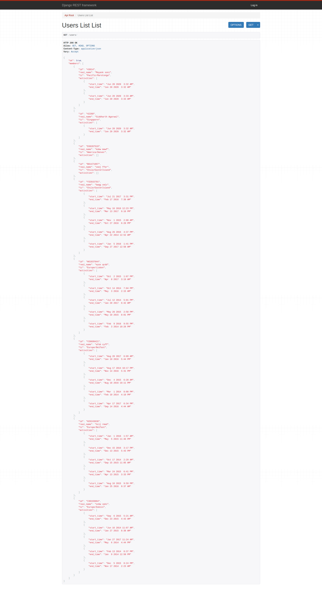

# REST API Development
This is a Production ready Django Web Application having Django-Rest API that serves a list of members(users) and their respective active periods. Active period basically includes the time at which member logs into the system(start_time) and logs out of the system(end_time). Custom management command to populate the database is also included.

---

## Tech/framework used
* asgiref==3.2.10
* autopep8==1.5.3
* Django==2.0.6
* django-timezone-field==4.0
* djangorestframework==3.9.2
* pycodestyle==2.6.0
* pytz==2020.1
* sqlparse==0.3.1
* toml==0.10.1
<br/>

## Demo
Currently Hosted at PythonAnywhere server: http://siddharth0815.pythonanywhere.com/
<br/>


<br/>
<br/>

## High level overview:
This Django project consists of a single app :
* Users

### Users
Users app is responsible for serving the get request at the following mentioned API end-point by making queries to the database and performing serialization. This APP also stores the data related to the users active period like start time and end time. 
It contains two models :
* User model : For user related operations
* Activity model : For operations regarding start-time and end-time

#### Custom Management Command to populate the database
This command can be run by `python manage.py populate_UserRecord` .<br/>
It populates the database with dummy data .Its code is present under Users APP as follows `Users/management/commands/populate_UserRecord.py`

---
## Rest-API end-point

Get request for the list of members and their respective activity periods. <br/>

* /users <br/>
Response:
* ok is a json boolean field.
* members is a json array of Users
* Each User object has following fields id, real_name, tz(timezone) and activities.
* activities is again a json array of active time period.
* Each active time period has start_time and end_time fields.
```json
{
    "ok": true,
    "members": [
        {
            "id": "A15472216",
            "real_name": "skus kfpj",
            "tz": "Europe/Dublin",
            "activities": [
                {
                    "start_time": "Nov 27 2017 10:12 PM",
                    "end_time": "Oct  5 2017  4:37 PM"
                },
                {
                    "start_time": "Apr 14 2015 12:46 PM",
                    "end_time": "May  4 2017  3:23 PM"
                }
            ]
        },
        {
            "id": "Y37307426",
            "real_name": "eukb lssk",
            "tz": "Europe/Belfast",
            "activities": [
                {
                    "start_time": "Dec  3 2016 10:33 PM",
                    "end_time": "Sep  4 2016 10:02 PM"
                },
                {
                    "start_time": "Jan 15 2015  8:21 AM",
                    "end_time": "Jun 23 2017 10:43 PM"
                },
                {
                    "start_time": "Mar 15 2015  3:27 PM",
                    "end_time": "Aug 22 2016  3:29 PM"
                }
            ]
        }
    ]
}
```
## Database Models used

#### User:<br/>
User models is a simple Django model. <br/>
Having Fields as follows <br/>
* id  
* real_name 
* tz for timezone 


#### Activity: <br/>
Activity is a simple Django model having:
* user (Foreign Key User model)
* start_time 
* end_time 

## Hosting locally:
**Step-1:** Clone the repo to your system.

**Step-3:** Create virtual environment

**Step-2:** Run command: `pip install -r requirements.txt`

**Step-3** Run command: `python manage.py makemigrations`

**Step-4** Run command: `python manage.py migrate`

**Step-5** Run command: `python manage.py populate_UserRecord`

**Step-6** Run command: `python manage.py runserver`
<br/>

## Viewset

         
          from Users.models import User, Activity
          from rest_framework import viewsets
          from rest_framework.views import APIView
          from rest_framework.response import Response
          from Users.serializers import UserSerializer, ActivitySerializer

          class UsersList(viewsets.ViewSet):
              queryset = User.objects.all().order_by('id')
              serializer_class = UserSerializer
              def list(self, request):
                  queryset = User.objects.all()
                  serializer = UserSerializer(queryset, many=True)
                  return Response({
                      'ok': True,
                      'members': serializer.data
                      })


     
## Custom Management Command to populate the database
This command fills the database with the dummy data.<br/>
command: `python manage.py populate_UserRecord` <br/>
